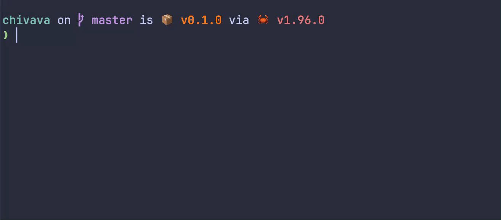

# Chivava

An offline terminal typing trainer for book excerpts and real code, with Vim-style editing, themes, and optional keyboard sounds.



## Install

```sh
curl -fsSL https://github.com/vimhead/chivava/releases/download/tip/install.sh | sh
```

Installs the rolling `tip` prerelease to `~/.local/bin`. Re-run to update, and make sure that directory is on your `PATH`.

| System | Supported builds |
| --- | --- |
| macOS 11+ | Apple Silicon, Intel |
| Linux | ARM64, x86-64; glibc 2.35+ and ALSA |
| Windows | x64; download `chivava-windows-x64.exe` from [releases](https://github.com/vimhead/chivava/releases/tag/tip) |

## Use

```sh
chivava
```

Typing starts immediately. Choose **Prose** or **Code**, books or languages, a theme, and an optional timer in settings.

| Key | Action |
| --- | --- |
| F1 | Help and Vim controls |
| F2 | Settings |
| F5 | Restart |
| Ctrl-C | Quit |

Settings are also available from the command line:

```sh
chivava config set mode code
chivava config set theme nord
chivava themes list
chivava --export-stats ./stats.json
chivava --help
```

## Nix and Home Manager

```sh
nix run github:vimhead/chivava/master
```

With the Home Manager module imported:

```nix
programs.chivava = {
  enable = true;
  settings.theme = "catppuccin-latte";
};
```

Only explicitly declared settings are locked; everything else remains editable. See [Nix setup](docs/nix.md) for the flake input and module import.

## Development

See [building and testing](docs/development.md).

## License

[MIT](LICENSE). Bundled text, code, fonts, and audio retain their own licenses; see [notices](assets/NOTICE.txt) or run `chivava licenses`.
